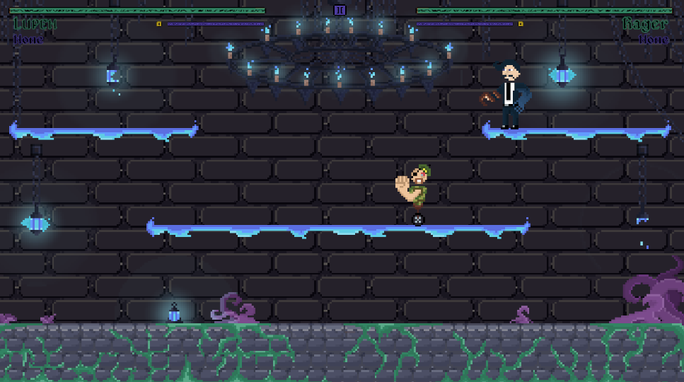
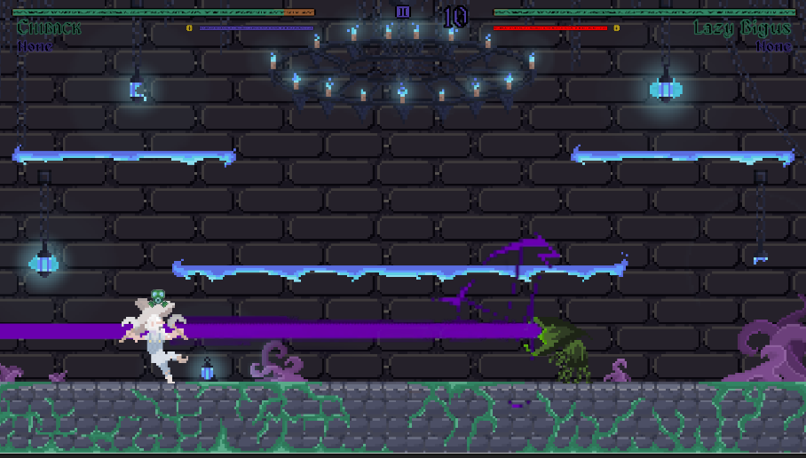
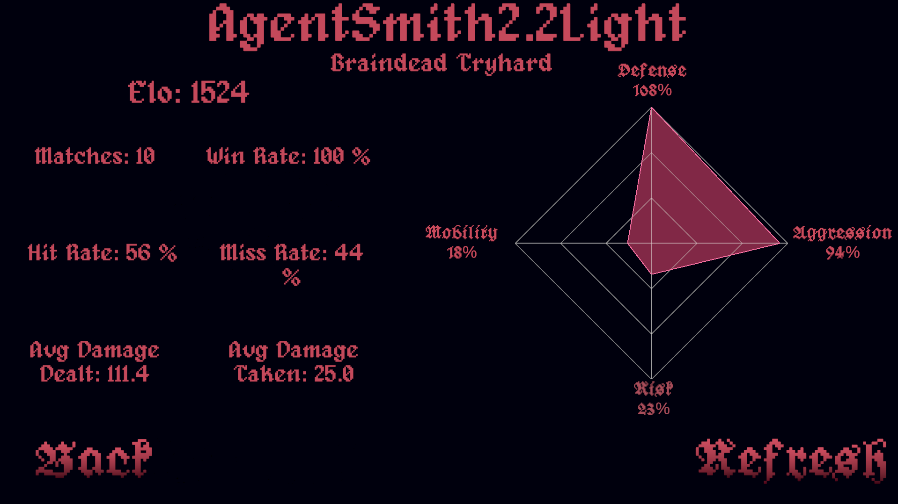
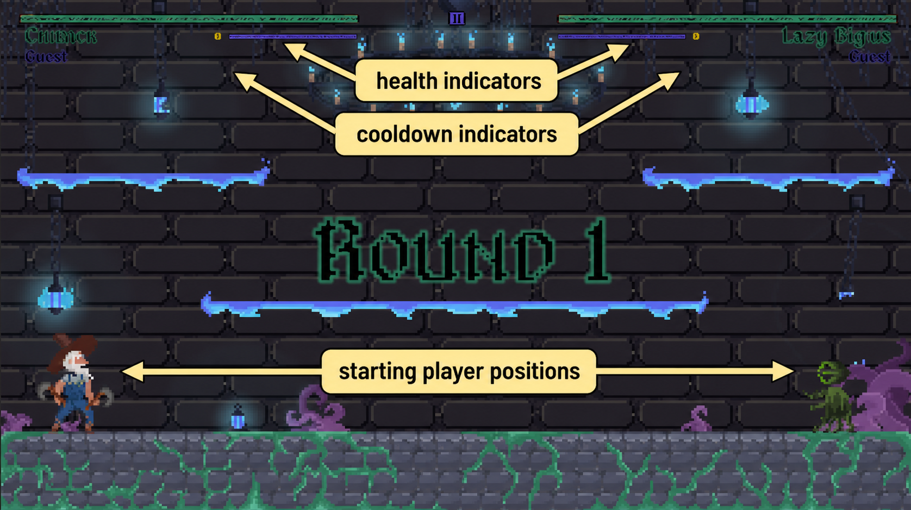

# D.I.E.N.A.M.O.

D.I.E.N.A.M.O. is a 2D Unity arena fighter by XLR8. The project focuses on fast local matches, character-specific abilities, custom match rules, player profiles, replays, telemetry, and AI opponents trained with Unity ML-Agents.

The repository folder still uses `Head-of-Hell` in some paths because the game was originally developed under that working title. The intended public game name is `D.I.E.N.A.M.O.`

## Current Status

D.I.E.N.A.M.O. is in active development and already includes playable local PvP and PvE flows, character selection, match customization, replays, profile data, and trained-agent integration.

## Media

| Gameplay | Ability Use |
| --- | --- |
|  |  |

| Player Profile Analysis | Match Overlay |
| --- | --- |
|  |  |

Gameplay clips:

- [Human vs Agent - Round 1](media/videos/human-vs-agent-round-1.mp4)
- [Human vs Agent - Round 2](media/videos/human-vs-agent-round-2.mp4)

Animated samples:

- [Game Tutorial](media/gifs/game-tutorial.gif)
- [Decision Complexity Sample](media/gifs/decision-complexity-sample.gif)

## Project Highlights

- Local 2D arena combat with movement, jumping, quick attacks, heavy attacks, blocking, parrying, charge attacks, projectiles, and character-specific abilities.
- PvP support for `1v1`, `1v1v1`, and `2v2` match setups.
- PvE setup with `Scripted Bot` and `ML Agent` opponent options across `Easy`, `Medium`, and `Hard` difficulty choices.
- Ten playable character identities in the current codebase: Steelager, Vander, Rager, Skipler, Fin, Lazy Bigus, Lithra, Chiback, Lupen, and Visvia.
- Custom rulesets for rounds, starting health, powerups, hidden health, player speed, disabled actions, portals, developer tools, and Chan Chan mode.
- Player profile creation, profile selection, profile analysis data, and menu stats display.
- Replay recording, replay browsing, and replay playback based on captured input frames.
- Match telemetry written to local JSON sessions for later analysis.
- Unity ML-Agents training/runtime work, including curated trained ONNX agents in `Assets/SuccessfulAgents/`.

## Repository Layout

```text
.
|-- README.md
|-- CREDITS.md
|-- CONTRIBUTING.md
|-- media/
|   |-- gifs/
|   |-- screenshots/
|   `-- videos/
|-- .gitattributes
`-- Head-of-Hell/
    |-- .gitignore
    |-- Assets/
    |   |-- Scenes/
    |   |-- Scripts/
    |   |-- CustomizationScripts/
    |   |-- SuccessfulAgents/
    |   `-- results/hoh_run1/
    |-- Packages/
    `-- ProjectSettings/
```

The Unity project folder is `Head-of-Hell/`. Open that folder in Unity Hub, not the repository root.

## Unity Setup

1. Install Unity `2022.3.24f1`.
2. Open the `Head-of-Hell/` folder with Unity Hub.
3. Let Unity restore packages from `Head-of-Hell/Packages/manifest.json`.
4. Start from `Assets/Scenes/HoHMainMenu.unity` for the main menu flow.

The configured build scenes are:

- `Assets/Scenes/HoHMainMenu.unity`
- `Assets/Scenes/GamePlayScene.unity`
- `Assets/Scenes/Intro.unity`
- `Assets/Scenes/TutorialScene.unity`

## Tech Stack

- Unity `2022.3.24f1`
- Universal Render Pipeline `14.0.10`
- Unity Input System `1.7.0`
- Unity ML-Agents `2.0.2`
- TextMeshPro
- Git LFS for selected large media formats (`.mp3`, `.mp4`, `.gif`)

## Gameplay Overview

The current flow supports local PvP and PvE play. PvP can be played as two-player duels, three-player free-for-all, or two-versus-two teams. PvE lets a player choose between a scripted bot and an ML-Agent-based bot, then select a difficulty.

Match setup includes character selection, stage selection, and optional custom rulesets. Custom rulesets can change the number of rounds, starting health, powerup behavior, movement speed, available actions, portal count, hidden-health behavior, and special Chan Chan behavior.

Controls are assigned through player and character setup in the Unity scenes. The tutorial reads the active key bindings when prompting the player.

## AI And Training

The repository includes two kinds of AI-related material:

- Runtime/experimental AI code under `Assets/Scripts/RL/`.
- Curated trained ONNX agents under `Assets/SuccessfulAgents/`, including `AgentSmith3.2.onnx`.

The preserved `Assets/results/hoh_run1/` folder contains the selected ML-Agents training run kept with the project.

For the reinforcement-learning thesis materials and playable agent demo, see the companion repository:

- [RL-Agent Thesis](https://github.com/dufenshmirtz/RL-Agent-Thesis)

## Repository Notes

- Unity-generated cache folders and build outputs are excluded from version control.
- Some paths still use `HoH` or `Head-of-Hell` because those names were part of the original project structure.
- Runtime-trained agents are stored in `Head-of-Hell/Assets/SuccessfulAgents/`.

## Credits And License

Team credits are listed in `CREDITS.md`.

No open-source license has been selected. Unless a `LICENSE` file is added, the code, assets, models, audio, and other project materials are not licensed for reuse.
